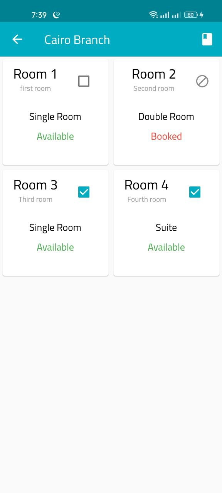

# B-Hotels

A Booking system app for a Hotel that has several branches.

## Details

In this project we designed Database SQLite, created booking system using Flutter & Dart

- Riverpod State Management.
- Flutter Architecture using Riverpod (Still not completed)
- Sqlite for local database
- Most of the dimensions are responsive to many screen sizes (But didn't have time to make it the best)

## ERD for SQLite

## Features

- Simple login screen to authenticate user before using the app

- Simple sign up screen

- Validation for all fields

- Show all Hotel branches so user can select one of them

- A report-like page to display all the rooms in the hotel and their status, e.g., booked, available.

- User can select one room or more to start booking (Of course he cannot select Booked rooms)

- When user starts booking, he will get all needed details about this new booking, and he can increase number of persons in a double room or a suite

- In all reservations list, user can preview his reservation with its details (And it will be updated in next version of the app)

- The system gives a discounted price (95%) if the customer has booked previously in the hotel.

## Try the app on android

- You can try the app on android device with this apk file:
  https://www.dropbox.com/s/jl41q91aa8fgiws/bhotels.apk?dl=1
- Note : You need to sign up to use the app, fill any dummy data and it will work

## Notes

- The app is functional, and it will be updated.
- The app is incomplete, i think its enough for what i wanted to achieve.
- With some time and effor it can be much better.
- All data in the app are dummy data, and dates are fixed and unchangable due to lack of time.
- Of course design needs many adjusments and code needs some refactoring.
